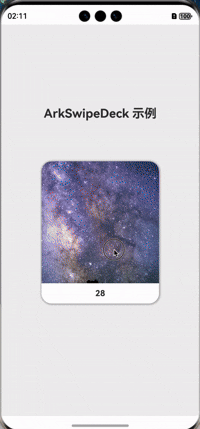

# ArkSwipeDeck - 鸿蒙卡片堆叠滑动组件

[](https://opensource.org/licenses/Apache-2.0)
[](https://developer.harmonyos.com/)
[](https://developer.harmonyos.com/cn/docs/documentation/doc-guides/arkts-get-started-0000001504769321)

> [English Version](./README.en.md)

---

<p align="center">
  
</p>

> 纯净的鸿蒙ArkTS卡片堆叠滑动组件，提供 Tinder 风格的滑动交互、流畅动画和完整的事件回调体系。

---

## ✨ 特性亮点

- 🧩 **纯容器设计**：不预设UI样式，完全可自定义
- 🏗️ **Builder模式**：通过ArkTS Builder自定义卡片内容
- 🎭 **Tinder风格交互**：经典卡片堆叠滑动体验
- ⚡ **流畅动画**：支持弹性、摩擦、缓动等多种动画类型
- 🕹️ **丰富手势**：支持拖拽、滑动、回弹等交互
- 🛰️ **完整事件系统**：支持滑动、点击、栈空等事件回调
- 🔄 **编程式控制**：API支持程序化滑动、重置等操作
- ♻️ **无限循环模式**：支持无限循环卡片堆叠
- 📱 **响应式设计**：自适应不同屏幕尺寸
- 🚀 **高性能**：优化的渲染与内存管理

---

## 🚀 快速开始

### 运行示例

1. 使用 DevEco Studio 打开项目
2. 选择 `entry` 模块作为运行目标
3. 点击运行按钮，体验完整卡片滑动功能

### 集成到你的项目

1. 复制 `library/` 目录到你的ArkTS工程中
2. 在你的页面中导入核心组件：

```typescript
import { SwipeCardStack } from '../library';
import type { UserInfo } from '../library/src/main/ets/types/SwipeCardTypes';

@Component
struct MyComponent {
  @State private cards: UserInfo[] = [
    { src: 'https://example.com/image1.jpg' },
    { src: 'https://example.com/image2.jpg' }
  ];

  build() {
    SwipeCardStack({
      cardDataList: this.cards,
      cardBuilder: this.buildCard
    })
  }

  @Builder
  buildCard(data: UserInfo, index: number) {
    Image(data.src ?? '')
      .width('100%')
      .height('100%')
      .borderRadius(20)
  }
}
```

---

## 📚 详细API文档

### SwipeCardStack 组件属性

| 属性名            | 类型                        | 必需 | 默认值      | 说明                     |
|-------------------|-----------------------------|------|-------------|--------------------------|
| cardDataList      | `object[]`                  | ✅   | `[]`        | 卡片数据列表             |
| swipeConfig       | `SwipeConfig`               | ❌   | `{}`        | 滑动配置选项             |
| onCardSwiped      | `OnCardSwipedCallback`      | ❌   | `undefined` | 卡片滑动回调             |
| onCardClicked     | `OnCardClickedCallback`     | ❌   | `undefined` | 卡片点击回调             |
| onStackNearEmpty  | `OnStackNearEmptyCallback`  | ❌   | `undefined` | 卡片栈即将为空回调       |
| onStackEmpty      | `OnStackEmptyCallback`      | ❌   | `undefined` | 卡片栈为空回调           |
| cardBuilder       | `@BuilderParam`             | ❌   | `undefined` | 自定义卡片内容构建器     |

### 公共方法

```typescript
// 程序化向左滑动
swipeLeft(): void

// 程序化向右滑动  
swipeRight(): void

// 重置卡片栈到初始状态
reset(): void

// 获取剩余卡片数量
getRemainingCount(): number
```

### 配置选项 (SwipeConfig)

```typescript
interface SwipeConfig {
  maxVisibleCards?: number;    // 最大可见卡片数 (默认: 4)
  minStackSize?: number;       // 触发栈即将为空的最小卡片数 (默认: 2)
  rotationAngle?: number;      // 卡片旋转角度 (默认: 15)
  scaleRatio?: number;         // 卡片缩放比例 (默认: 0.95)
  swipeThreshold?: number;     // 滑动触发阈值 (默认: 100)
  animationDuration?: number;  // 动画持续时间 (默认: 300)
  enableSpringBack?: boolean;  // 是否启用弹簧回弹 (默认: true)
  cardSpacing?: number;        // 卡片间距 (默认: 8)
}
```

### 回调函数类型

```typescript
// 卡片滑动回调
type OnCardSwipedCallback = (direction: SwipeDirection, data: object, index: number) => void;

// 卡片点击回调
type OnCardClickedCallback = (data: object, index: number) => void;

// 卡片栈即将为空回调
type OnStackNearEmptyCallback = (remainingCount: number) => void;

// 卡片栈为空回调
type OnStackEmptyCallback = () => void;
```

### 卡片数据结构（示例）

```typescript
interface UserInfo {
  src?: string; // 图片地址
  // 你可以根据业务扩展更多字段
}
```

### 滑动方向 (SwipeDirection)

```typescript
enum SwipeDirection {
  LEFT = 'left',
  RIGHT = 'right',
  UP = 'up',
  DOWN = 'down'
}
```

---

### 高级用法

#### 自定义配置

```typescript
const customConfig: SwipeConfig = {
  maxVisibleCards: 3,
  rotationAngle: 20,
  scaleRatio: 0.9,
  swipeThreshold: 150,
  animationDuration: 400,
  enableSpringBack: true,
  cardSpacing: 12
};

SwipeCardStack({
  cardDataList: this.cards,
  swipeConfig: customConfig,
  onCardSwiped: this.handleCardSwiped,
  cardBuilder: this.buildCard
})
```

#### 完整事件处理

```typescript
private handleCardSwiped: OnCardSwipedCallback = (direction: SwipeDirection, data: object, index: number): void => {
  switch (direction) {
    case SwipeDirection.LEFT:
      console.log('不喜欢:', data);
      break;
    case SwipeDirection.RIGHT:
      console.log('喜欢:', data);
      break;
  }
}

private handleCardClicked: OnCardClickedCallback = (data: object, index: number): void => {
  // 处理卡片点击
  this.showCardDetail(data);
}

private handleStackNearEmpty: OnStackNearEmptyCallback = (remainingCount: number): void => {
  // 加载更多数据
  this.loadMoreCards();
}

private handleStackEmpty: OnStackEmptyCallback = (): void => {
  // 显示空状态
  this.showEmptyState();
}
```

#### 程序化控制

```typescript
// 获取组件引用
@State swipeCardRef: SwipeCardStack | null = null;

// 在按钮点击时控制滑动
Button('不喜欢')
  .onClick((): void => {
    this.swipeCardRef?.swipeLeft();
  })

Button('喜欢')  
  .onClick((): void => {
    this.swipeCardRef?.swipeRight();
  })

Button('重置')
  .onClick((): void => {
    this.swipeCardRef?.reset();
  })
```

---

### 性能优化建议

- 使用轻量级布局组件，避免卡片内容复杂嵌套
- 合理设置 `maxVisibleCards` 数量，提升渲染效率
- 在 `onStackNearEmpty` 或 `onLoadNextPage` 中分批加载数据
- 动画参数建议使用默认值以获得最佳性能
- 及时清理已滑出的卡片数据，避免内存泄漏

---

### 常见问题 FAQ

**Q: 卡片不响应滑动手势？**
A: 检查卡片内容是否阻止了手势传播，确保没有其他手势处理器拦截事件。

**Q: 动画卡顿？**
A: 尝试降低 `maxVisibleCards` 数量，简化卡片内容，或调整动画参数。

**Q: 内存占用过高？**
A: 实现数据的动态加载和清理，避免一次性加载大量卡片数据。

---

## 🏗️ 项目结构

```
ArkSwipeDeck/
├── entry/                  # 示例应用（入口）
│   └── src/main/ets/pages/
│       └── Index.ets       # 示例页面，演示完整用法
├── library/                # 组件库源码
│   ├── Index.ets           # 统一导出入口
│   ├── README.md           # 详细API文档
│   └── src/main/ets/
│       ├── components/     # SwipeCardStack等核心组件
│       ├── types/          # 类型定义
│       ├── utils/          # 工具类
│       └── constants/      # 常量配置
└── README.md               # 项目说明（当前文件）
```

---

## 🤝 贡献

欢迎提交 Issue 和 Pull Request！

---

## 📄 许可证

本项目基于 [Apache-2.0](LICENSE) 许可证开源。

---

## 🔗 相关链接

- [HarmonyOS开发文档](https://developer.harmonyos.com/)
- [ArkTS语法指南](https://developer.harmonyos.com/cn/docs/documentation/doc-guides/arkts-basic-syntax-overview-0000001531611153)
- [项目主页](https://github.com/kumaleap/ArkSwipeDeck)

---

⭐ 如果这个项目对你有帮助，请点个 Star 支持一下！